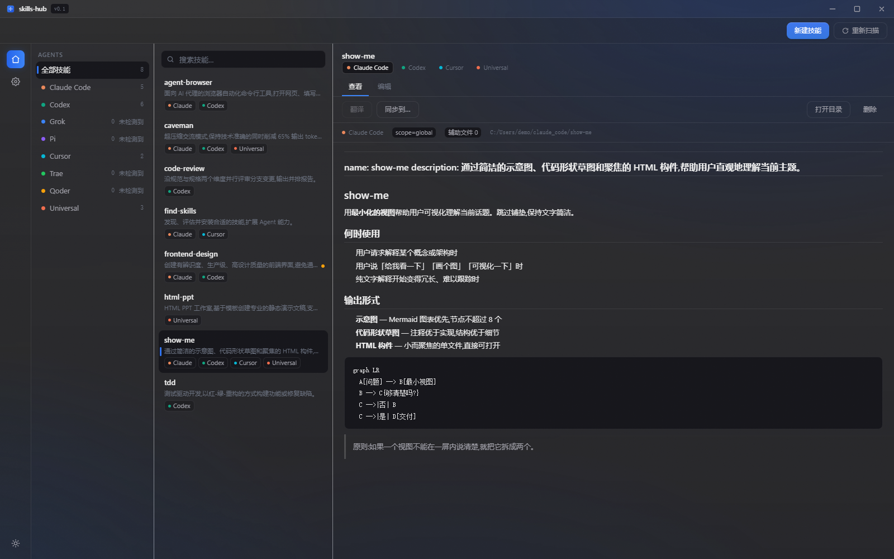

# skills-hub

统一管理本机 8 个 AI agent 的 skills 的桌面应用:查看、编辑、新建、删除、跨 agent 同步、一条命令从 GitHub 安装、DeepSeek 翻译阅读。

[官网与使用文档](https://xiami-long.github.io/skills-hub/) · [下载最新版](https://github.com/XiaMi-Long/skills-hub/releases/latest)



## 功能特性

### 统一管理 8 个 agent

启动即扫描本机全部 skills 目录,同名技能自动归组,副本内容不一致时显示漂移提示:

| Agent | 默认目录 |
| --- | --- |
| Claude Code | `~/.claude/skills` |
| Codex | `~/.codex/skills` |
| Grok | `~/.grok/skills` |
| Pi | `~/.pi/agent/skills` |
| Cursor | `~/.cursor/skills` |
| Trae | `~/.trae/skills` |
| Qoder | `~/.qoder/skills` |
| Universal | `~/.agents/skills` |

目录不存在不报错(计数 0 + 未检测到);路径可在设置里覆盖。

### 命令添加技能

新建技能 →「命令添加」,粘贴一条命令即可从 GitHub 安装:

```bash
npx skills add https://github.com/humanlayer/skills --skill show-me
```

- 兼容裸链接、`owner/repo`、`/tree/分支/子路径`、SSH 形式;多技能仓库列出供选择,`--skill` 命中自动选中
- 下载前可编辑名字/描述/正文,辅助文件原样安装(staging 原子替换,失败不留半成品)
- 配置 DeepSeek Key 后可 **AI 解读**:读取技能内容生成标题、描述与摘要
- 安装目标支持全部 / 单个任选(与同步弹窗同款),同名冲突需勾选覆盖

### 同步

把技能复制到任意 agent 组合:已有副本带「已存在」徽标,冲突逐条决策(覆盖/跳过),结果逐条汇总。

### DeepSeek 翻译阅读

- 流式翻译英文技能,内容寻址缓存(多副本共享),三态管理(hit/stale/none)
- 一键翻译全部(去重、可取消),译文可写回原文

### 质感视觉

- **全局质感背景**(设置 → 外观):窗口亚克力透明(透到桌面)+ 渐变背景 + 颗粒噪点 + 半透明磨砂面板;关闭为实心纯色
- 暗/亮/跟随系统主题,五种色调;设置项自带功能性动画(星星闪烁/光芒旋转/昼夜流转/水纹晕染/迷你窗口演示)
- Markdown 预览四种排版主题:极简 / 文档 / 暖纸 / 紧凑,实时预览

### 其他

- 列表搜索(Ctrl+F)、窗口 focus 自动重扫、资源管理器定位
- CodeMirror 原文编辑(Ctrl+S 保存),磁盘外部修改保护(mtime 校验 + 二次确认)
- 启动 loading 页、自绘标题栏、Toast 反馈

## 下载安装

Windows 10/11 x64:到 [Releases](https://github.com/XiaMi-Long/skills-hub/releases/latest) 下载 `skills-hub_x.x.x_x64-setup.exe` 运行安装。

> 暂未配置自动更新:新版本覆盖安装即可,设置与翻译缓存保存在应用数据目录,不受影响。
> 「全局质感背景」需要系统「设置 → 个性化 → 颜色 → 透明度效果」开启。

## 从源码构建

前置:Node.js 18+、Rust stable(MSVC)、Tauri v2 环境。

```bash
git clone https://github.com/XiaMi-Long/skills-hub.git
cd skills-hub
npm install

npm run tauri dev            # 开发
npm run tauri build -- --bundles nsis   # 打包 NSIS 安装包
```

官网(VitePress)在 `docs/` 目录:

```bash
cd docs
npm install
npm run dev                  # 本地预览
npm run build                # 产物在 docs/.vitepress/dist
```

## 技术栈

Rust + Tauri v2 · React 19 + TypeScript + Vite + Tailwind v4 + zustand · CodeMirror 6 · react-markdown · DeepSeek(OpenAI 兼容接口)。

完整实施规格见 [`DESIGN.md`](DESIGN.md)。

## 项目结构

```
src-tauri/src/
├── agents.rs       # 8 个 agent 注册表
├── scanner.rs      # 目录扫描、归组、漂移计算
├── frontmatter.rs  # SKILL.md frontmatter 解析与兜底
├── sync.rs         # staging → rename 同步引擎
├── remote.rs       # 命令添加:npx 命令解析 + GitHub 拉取 + 缓存
├── llm.rs          # DeepSeek 流式翻译 + 内容寻址缓存
├── settings.rs     # 设置原子读写
├── commands.rs     # 全部 Tauri 命令
└── lib.rs          # Builder 装配

src/
├── shell/ sidebar/ list/ detail/   # 四列主界面
├── modals/          # 新建(手动/命令添加)、同步、删除等弹窗
├── settings/        # 设置页(外观/Agents/翻译/批量操作)
└── ui/              # Button/Checkbox/Modal/Toast 等自绘控件
```
