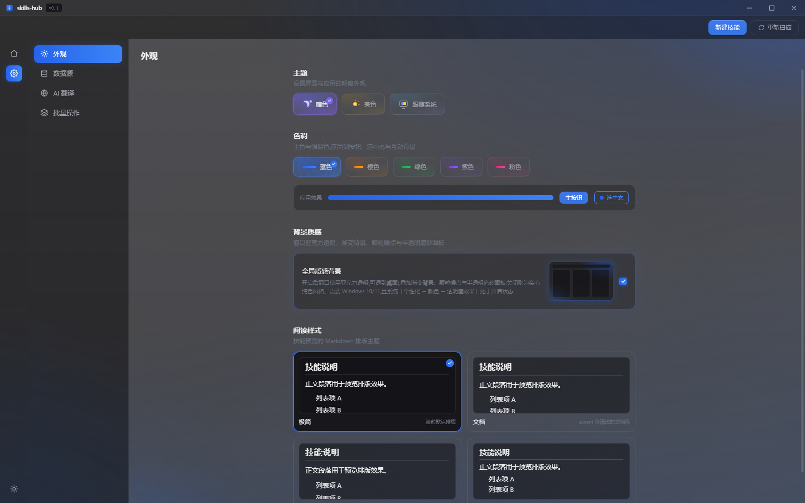
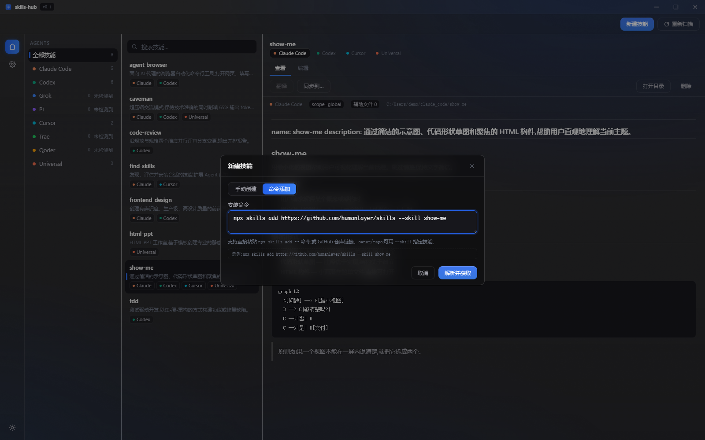
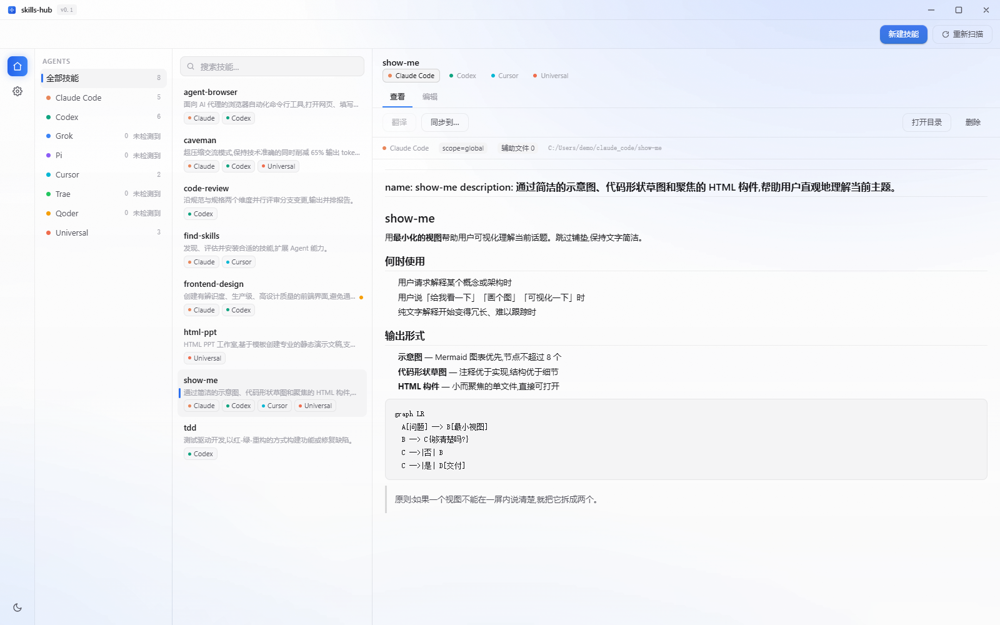

## 界面预览

### 主界面 · 暗色

技能列表按名字归组,右侧渲染 SKILL.md;窗口亚克力透明,渐变与颗粒质感穿透面板。

### 设置 · 外观

主题与色调按钮带功能性动画,「全局质感背景」卡片内嵌迷你窗口实时演示开关效果。

### 命令添加技能

粘贴 `npx skills add …` 命令即可解析 GitHub 仓库、下载技能文件、AI 解读并安装到所选 agent。

### 亮色主题

